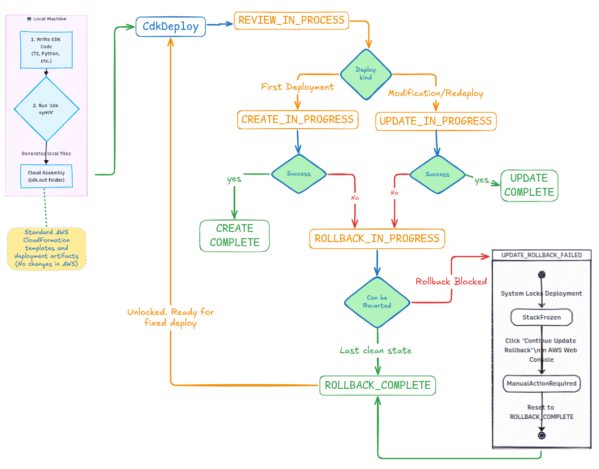
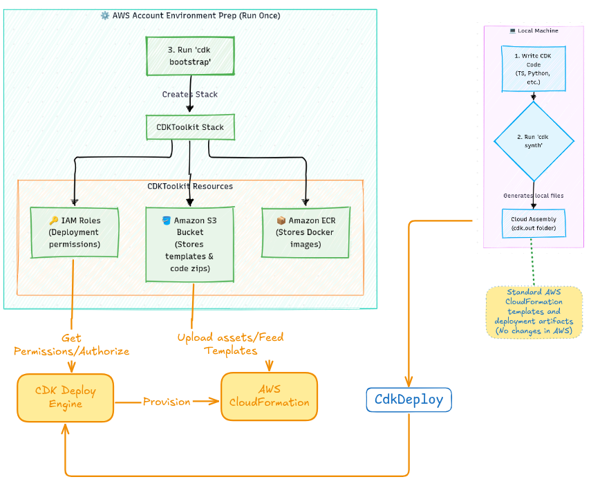

## CDK basic concepts

*  **cdk synth** acts entirely within the Local Machine boundary. It creates the blueprint files without touching AWS (cdk.out folder).
*  **cdk bootstrap** builds a foundational storage and security layer inside your AWS Account. It is independent of your app code and only needs to run once.  Creates the infrastructure (CDKToolKit) equired by the CDK CLI to accept incoming files, code dependencies, and templates from your machine
*  **cdk deploy** acts as the bridge, pushing your local blueprint and zipped assets into the bootstrap storage, which triggers AWS CloudFormation to build your final live application.

## AWS CloudFormation State Lifecycle

*  **REVIEW_IN_PROGRESS**: CloudFormation has received your template change set but is waiting for confirmation before executing it.
*  **CREATE_IN_PROGRESS**: AWS is actively provisioning the physical resources (e.g., spinning up your SQS queue or DynamoDB table).
*  **ROLLBACK_IN_PROGRESS**: A resource failed to build. Instead of leaving your infrastructure in a half-broken state, AWS automatically deletes what it just made to revert back to your last clean, working deployment.
*  **UPDATE_ROLLBACK_FAILED**: A critical error occurred while AWS was trying to revert your stack to its old state (e.g., a resource it needed to put back was manually deleted from the AWS Console outside of CDK). The deployment engine freezes for safety.

## Account environment

  
  **CDK Bootstrap**: Before deploying your first stack, you must run cdk bootstrap once per AWS account/region. This provisions a standard backend storage setup—similar to a Terraform S3 remote state bucket—which houses compressed Lambda code assets and deployment configurations.

> *It creates a physical CloudFormation stack named CDKToolkit directly inside your live AWS account.* And **runs directly on the aws account**

  **Resources it provisions**

1. **Amazon S3 Bucket**: Stores your generated CloudFormation templates and deployment assets (like zipped Lambda function code).
1. **Amazon ECR Repository**: Stores Docker container images if your application utilizes containers.
1. **IAM Roles**: Provisions dedicated deployment and execution roles so the CDK CLI has safe, scoped permissions to build your resources

  

| If you are deploying... | How many times do you run cdk bootstrap? | Why? |
| :--- | :--- | :--- |
| **5 different stacks** inside the same Account (`1111`) and Region (`us-east-1`). | **1 time total** | All 5 stacks share the same `CDKToolkit` S3 bucket and IAM roles. |
| **1 single stack** across a `Development` account and a `Production` account (both in `us-east-1`). | **2 times total** (Once per account) | They are physically independent AWS boundaries. |
| **1 single stack** deployed globally across `us-east-1` and `us-west-2` within the same account. | **2 times total** (Once per region) | CloudFormation assets must live inside an S3 bucket local to that specific deployment region. |
